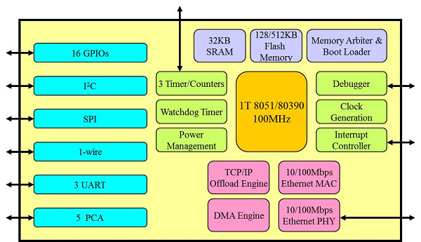
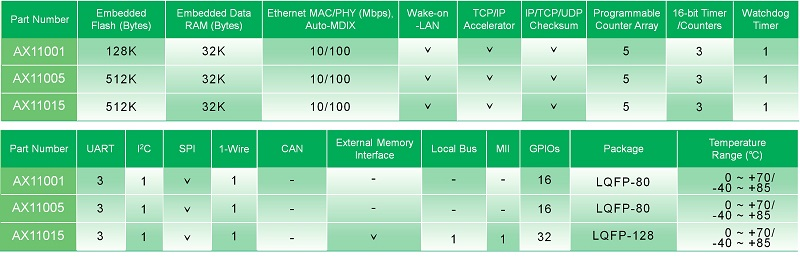

# [AX11001](https://github.com/sochub/AX11001)

#### 厂商：[asix亚信](https://github.com/sochub/asix)
#### 架构：[8051](https://github.com/sochub/8051)

AX11001系列单片机是比较少见的8051内核的网络通信芯片，集成 10/100M Ethernet MAC/PHY

###  [收录资源](https://github.com/sochub/AX11001)  

##  [SoC资源平台](http://www.qitas.cn)